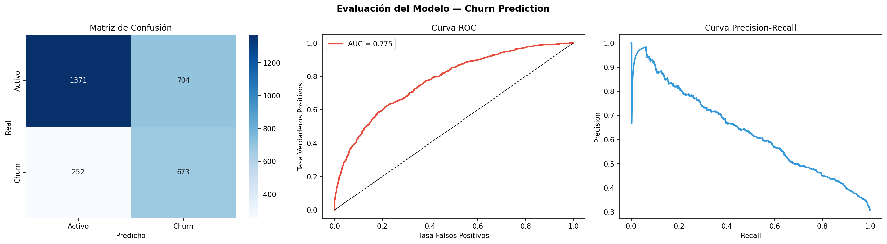
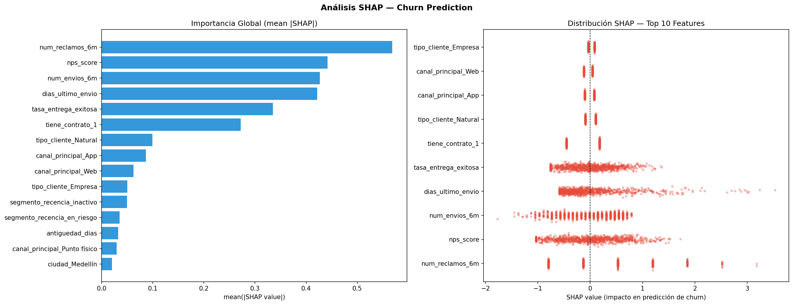
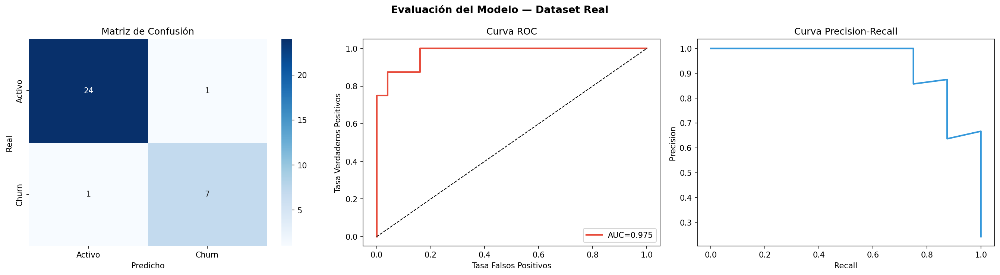
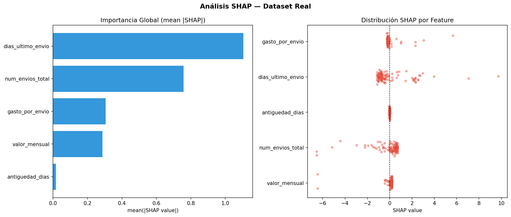
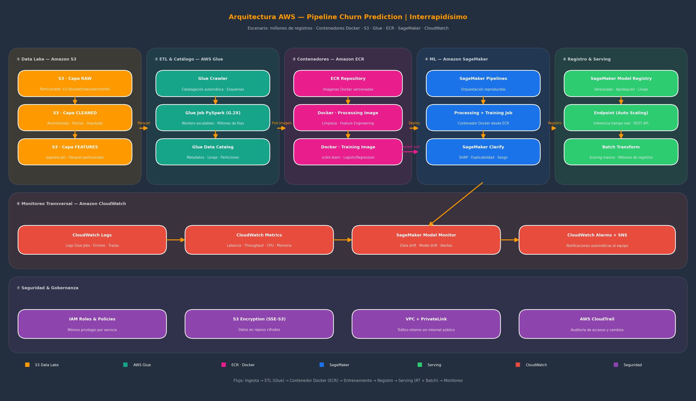

# 🚀 Churn Prediction — Interrapidísimo

**Autor:** Julian Echeverry  
**Rol:** Científico de Datos y Analítica  *Prueba técnica*
**Fecha:** 29 de Abril 2026

---

## 📋 Descripción del Proyecto

Pipeline completo de predicción de churn (fuga de clientes) para Interrapidísimo, empresa colombiana de mensajería y transporte de carga.

El proyecto aborda tres pilares principales:

1. **Data Governance & Cleaning**: tratamiento de datos sucios, anonimización de PII (datos sensibles de acuerdo con la ley 1581 de 2012), imputación de valores nulos y eliminación de duplicados.
2. **Advanced Analytics**: modelado predictivo con Regresión Logística, ingeniería de características y análisis de explicabilidad con SHAP.
3. **Cloud Architecture**: diseño de arquitectura conceptual en AWS (S3, Glue, ECR, SageMaker) para productivizar la solución a escala de millones de registros.

---

## 📁 Estructura del Repositorio

interrapidisimo-churn/
├── 1_data/
│   ├── synthetic_data/
│   │   ├── 1_raw/          ← dataset sintético crudo (10.300 filas)
│   │   ├── 2_cleaned/      ← capas de limpieza intermedias
│   │   └── 3_features/     ← pipeline.pkl entrenado
│   └── real_data/
│       ├── 1_raw/          ← dataset real de 114 filas (raw_data_customers_lpgr.csv)
│       ├── 2_cleaned/      ← dataset real limpio
│       └── 3_features/     ← pipeline_real.pkl entrenado
├── 2_notebooks/
│   └── 01_modeling_datasetsintetico.ipynb  ← notebook con narrativa completa
├── 3_src/
│   ├── synthetic_data/
│   │   ├── 1_governance/   ← scripts de limpieza dataset sintético
│   │   ├── 2_modeling/     ← scripts de modelado dataset sintético
│   │   └── 3_architecture/ ← diagrama AWS
│   └── real_data/
│       ├── 1_governance/   ← limpieza dataset real
│       └── 2_modeling/     ← modelado dataset real
└── 4_outputs/
		├── synthetic_data/
		│   ├── 1_figures/      ← gráficas EDA, modelo, SHAP
		│   └── 2_metrics/      ← reportes de calidad y modelo
		└── real_data/
			├── 1_figures/      ← gráficas modelo real
			└── 2_metrics/      ← reportes modelo real
|
└── 5_docs/
└── pyproject.toml

---

## ⚙️ Instalación y Ejecución en máquina local

### Requisitos
- Python 3.11
- Poetry 2.3+

### Pasos

```bash
# 1. Clonar el repositorio
git clone https://github.com/julianecheverry/interrapidisimo-churn.git
cd interrapidisimo-churn

# 2. Instalar dependencias
poetry install

# 3. Activar ambiente
poetry env use python3.11
# En Windows:
# "C:\\...\\interrapidisimo-churn-py3.11\\Scripts\\activate.bat"

# 4. Registrar kernel Jupyter
python -m ipykernel install --user --name=interrapidisimo-churn
```

### Ejecutar pipeline dataset sintético

```bash
# Fase 0 — Generar dataset sintético
python 3_src/generate_synthetic_data.py

# Fase 1 — Governance & Cleaning
python 3_src/synthetic_data/1_governance/01_eda_quality_report.py
python 3_src/synthetic_data/1_governance/02_anonymization.py
python 3_src/synthetic_data/1_governance/03_date_cleaning.py
python 3_src/synthetic_data/1_governance/04_imputation_dedup.py
python 3_src/synthetic_data/1_governance/05_cleaned_file.py

# Fase 2 — Modelado
python 3_src/synthetic_data/2_modeling/01_train_model.py
python 3_src/synthetic_data/2_modeling/02_shap_analysis.py

# Fase 3 — Arquitectura AWS
python 3_src/synthetic_data/3_architecture/01_aws_architecture.py
```

### Ejecutar pipeline dataset real

```bash
# Limpieza
python 3_src/real_data/1_governance/01_clean_real.py

# Modelado + SHAP
python 3_src/real_data/2_modeling/02_model_real.py
python 3_src/real_data/2_modeling/03_shap_real.py
```

---

## 🔬 Principales Decisiones Técnicas

### Data Governance
| Decisión | Justificación |
|---|---|
| Anonimización PII con SHA-256 | Irreversible pero permite cruzar tablas por ID |
| Imputación numérica con mediana | Robusta frente a valores extremos (dataset sintético tiene 325 outliers extremos) |
| Imputación categórica con moda | Preserva la distribución original |
| Fechas NaT excluidas del modelo | Insuficiente información para imputar fechas imposibles |
| Winsorización p99 en valor_total_6m | Trata outliers sin tener que eliminar filas con variables diligenciadas|

### Modelado
| Decisión | Justificación |
|---|---|
| Regresión Logística | Interpretable, serializable, estándar en predicción de churn |
| GridSearchCV 5-fold | Búsqueda exhaustiva de hiperparámetros con Cross Validation |
| ElasticNet | Regularización flexible L1+L2 que evita el sobre ajuste del modelo |
| scoring=Recall(pos_label=1) | El costo de no detectar un churner es mucho mayor que el costo de falso positivo (retención que no se necesita) |
| Umbral=0.28 (sintético) | Maximiza Recall manteniendo F1 aceptable |
| Umbral ajustado (real) | Mismo criterio — Recall >= 0.70 con mayor F1 |
| Exportación de los pipeline a un archivo serializable (.pkl) | Permite deployment directo en SageMaker |

---

## 📊 Resultados principales

### Dataset Sintético (10.000 filas)

**Desempeño del modelo**

| Métrica | Valor |
|---|---|
| Tasa de churn | 30.8% |
| AUC-ROC | 0.7749 |
| Recall Churn (umbral=0.28) | 0.73 |
| Precision Churn | 0.49 |
| F1 Churn | 0.58 |



**Top 3 variables SHAP:**



1. `num_reclamos_6m` — Los reclamos son el predictor más fuerte
2. `nps_score` — La satisfacción del cliente es clave
3. `num_envios_6m` — La actividad reciente refleja el compromiso

**── Métricas de impacto ────────────────────────────────────**
── Supuestos de negocio (configurables) ───────────────────
  LTV_PROMEDIO             : 345,200.00
  COSTO_INTERVENCION       : 15,000.00
  TASA_RETENCION           : 0.30

  Clientes churn detectados (TP) : 673
  Falsos positivos (FP)          : 704
  Clientes a contactar           : 1,377
  Clientes retenidos estimados   : 413
  Costo total campaña            : $20,655,000 COP
  Ingreso retenido estimado      : $142,567,600 COP
  ROI estimado del modelo        : 590.2%

  ⚠ Supuestos estimados — validar con áreas comercial y financiera para mayor precisión en métricas de negocio

### Dataset Real (110 filas)

**Desempeño del modelo**

| Métrica | Valor |
|---|---|
| Tasa de churn | 24.55% |
| AUC-ROC | 0.9750 |
| Recall Churn (umbral ajustado) | 0.88 |



**Top 3 variables SHAP:**



1. `dias_ultimo_envio` — Es el predictor más fuerte
2. `num_envios_total` — Menor cantidad de envíos → mayor riesgo de fuga del cliente
3. `gasto_por_envio` — Variable *Feature-engineered*: permite hacer una comparación del gasto de los clientes a escala.

**── Métricas de impacto de negocio ─────────────────────────**

── Supuestos de negocio (configurables) ───────────────────
  LTV_PROMEDIO             : 10,200.00
  COSTO_INTERVENCION       : 15,000.00
  TASA_RETENCION           : 0.30

  Clientes churn detectados (TP): 7
  Falsos positivos (FP)          : 1
  Costo total campaña            : $120,000 COP
  Ingreso retenido estimado      : $20,400 COP
  ROI estimado                   : -83.0%

  ⚠ Supuestos estimados — validar con áreas comercial y financiera para mayor precisión en métricas de negocio

### Recomendaciones generales para el Negocio

1. Realizar estudios de mercado para detectar los principales drivers del número de reclamos y del nps_score.
2. Aplicar modelos de lenguaje natural a las quejas registradas para detectar los principales drivers del número de reclamos y del nps_score.
3. Materializar en base de datos el seguimiento a las características del servicio prestado por los competidores (servientrega, Coordinadora, Envía, Velotax, Envíos Verdes, Omega, Uber, Didi, entre otros). Esto con miras a fortalecer la oferta de Interrapidísimo hacia cada segmento de clientes (envío ocasional de persona natural, envíos del segmento e-commerce, envíos de fabricantes de mercancías, etc), mejorando el número de envíos.

---

## 🏗️ Arquitectura AWS

El diagrama conceptual ilustra el flujo completo para un escenario
de **millones de registros de clientes utilizando contenedores Docker**:



**Componentes:**
- **S3** — Data Lake con capas RAW / CLEANED / FEATURES (Parquet particionado)
- **AWS Glue** — ETL con workers escalables G.2X para realizar transformaciones a millones de filas de manera automática.
- **Amazon ECR** — Repositorio de imágenes Docker versionadas para el reparto de las cargas de trabajo
- **SageMaker** — Manejo versionado y con directrices de gobernanza de modelos de Machine Learning, a través de Pipelines + Training Job + Clarify (SHAP) + Model Registry
- **Batch Transform** — Scoring masivo sobre millones de registros
- **CloudWatch** — Monitoreo de drift de datos y de métricas del modelo -> da la pauta para determinar necesidades de reentrenamiento del modelo.
- **IAM + VPC + CloudTrail** — Estándares de Seguridad y gobernanza (Encriptación, roles con principio de mínimo privilegio, tags para seguimiento a consola de costos por componente de nube [FINOPS])

---

## 📋 Diccionario de Datos

### Dataset Sintético — `raw_data_customers.csv`

| # | Variable | Tipo | Descripción | Variable sensible PII | Tratamiento |
|---|---|---|---|---|---|
| 1 | `customer_id` | string | Identificador único | ⚠️ Sí | Hasheado SHA-256 |
| 2 | `nombre` | string | Nombre completo | ⚠️ Sí | Eliminado |
| 3 | `email` | string | Correo electrónico | ⚠️ Sí | Eliminado |
| 4 | `telefono` | string | Teléfono | ⚠️ Sí | Eliminado |
| 5 | `fecha_registro` | string | Fecha de registro | No | Parseada multi-formato |
| 6 | `antiguedad_dias` | numérico | Días como cliente | No | Imputado mediana |
| 7 | `ciudad` | categórico | Ciudad de origen | No | Imputado moda |
| 8 | `tipo_cliente` | categórico | Natural/Empresa/Ecommerce | No | Imputado moda |
| 9 | `canal_principal` | categórico | App/Web/Punto físico/API | No | Imputado moda |
| 10 | `tiene_contrato` | binario | Contrato corporativo | No | Sin imputación |
| 11 | `num_envios_6m` | numérico | Envíos últimos 6 meses | No | Imputado mediana |
| 12 | `valor_total_6m` | numérico | Valor facturado 6 meses (COP) | No | Mediana + Winsorización p99 |
| 13 | `ticket_promedio` | numérico | Valor promedio por envío | No | Imputado mediana |
| 14 | `dias_ultimo_envio` | numérico | Días desde último envío | No | Imputado mediana |
| 15 | `num_reclamos_6m` | numérico | Reclamos últimos 6 meses | No | Imputado mediana |
| 16 | `tasa_entrega_exitosa` | numérico | % envíos exitosos | No | Imputado mediana |
| 17 | `nps_score` | numérico | Net Promoter Score | No | Imputado mediana |
| 18 | `churn` | binario | Variable objetivo | No | Target |

### Dataset Real — `raw_data_customers_lpgr.csv`

| # | Variable original | Variable limpia | Tipo | Tratamiento |
|---|---|---|---|---|
| 1 | `customer_id` | `customer_id` | string | Hasheado SHA-256 |
| 2 | `full_name` | — | string | Eliminado (PII) |
| 3 | `email` | — | string | Eliminado (PII) |
| 4 | `phone` | — | string | Eliminado (PII) |
| 5 | `home_address` | — | string | Eliminado (PII) |
| 6 | `signup_date` | `fecha_registro` | fecha | Parseada multi-formato |
| 7 | `last_purchase_date` | `fecha_ultimo_envio` | fecha | Parseada multi-formato |
| 8 | `monthly_spend` | `valor_mensual` | numérico | Negativos→NaN, Winsorización p99 |
| 9 | `total_shipments` | `num_envios_total` | numérico | Winsorización p99 |
| 10 | `churn_label` | `churn` | binario | Target |

---

## 🔒 Estándares AWS Aplicados

- **IAM**: roles con principio de mínimo privilegio por servicio
- **S3**: encriptación SSE-S3 en reposo, TLS en tránsito
- **VPC + PrivateLink**: tráfico interno sin exposición a internet
- **CloudTrail**: auditoría completa de accesos y cambios
- **ECR**: imágenes Docker versionadas con escaneo de vulnerabilidades
- **SageMaker Model Monitor**: detección automática de data drift y model drift
- **CloudWatch Alarms + SNS**: alertas automáticas al equipo de ML

De acuerdo con los principios FINOPS, se recomienda disminuir en lo posible los costos de almacenamiento en contenedores S3 que es uno de los componentes de mayro costo, en favor de la optimización de las capacidades de cómputo (Sagemaker). Adicionalmente, se recomienda realiza un análisis de costo beneficio para los tipos de procesamiento entre Cloud y On-premise.
---
### 📊 Reportes detallados  — Datos sintéticos (10.000 filas)

Disponibles en la subcarpeta `4_outputs/synthetic_data/2_metrics`, a saber:

- 01_quality_report
- 02_anonymization_report
- 03_date_cleaning_report
- 04_imputation_report
- 05_cleaned_layer_report
- 06_model_report
- 07_shap_report

---
### 📊 Reportes detallados  — Datos reales (110 filas)

Disponibles en la subcarpeta `4_outputs/real_data/2_metrics`, a saber:

- 01_clean_real_report
- 02_model_real_report
- 03_shap_real_report